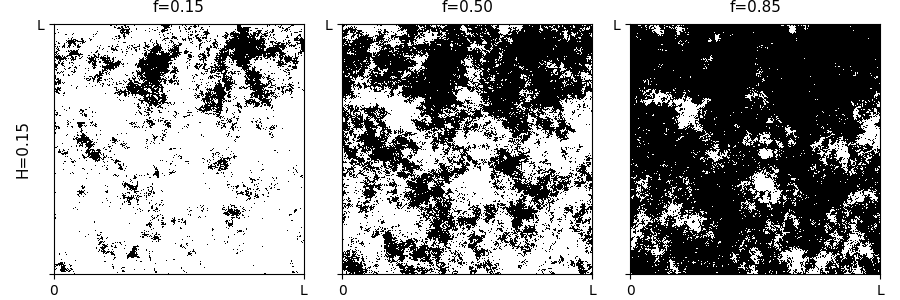
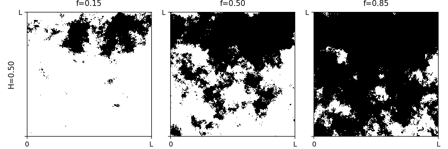
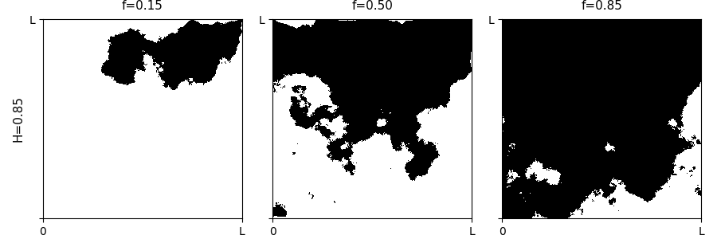
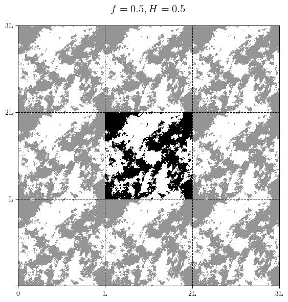

# Landscape models 
Landscape models for use in styding (collective) foraging and/or other research.

## 2D fractional Brownian motion 
The relevant file to run is `generate_landscape.py`.
It depends on the standard `numpy` and `matplotlib` libraries, but also on the `numba` library that enables blazingly fast calculations in Python. 
Simply installing these libraries through `pip` and/or `conda` should work. 
Note that `numba` compiles the Python code, and therefore the initial run should take (a bit) more time. 
Subsequent executions should take much less time to execute. 

Default parameters are sensible, but can be tuned by including flags when you run the code. 
Please run `python generate_landscape.py --help` for more details.

#### Methods for enerating fractional Brownian motion
The methods that are currently implemented in `src/fBm.py` are the following:
* `Brownian`: Standard Brownian motion through Langevin equation 
* `circulant_embedding1D`: Spectral synthesis in one dimension, as per [Kroese & Botev (2015)](https://arxiv.org/pdf/1308.0399v1.pdf)
* 
* `midpoint2D`: Midpoint method, see e.g. [Saupe (1998)](https://link.springer.com/chapter/10.1007/978-1-4612-3784-6_2)
* `midpointPBC2D`: Midpoint method with periodic boundary conditions
* `spectral_synthesis2D`: Spectral synthesis in two dimensions [Saupe (1998)](https://link.springer.com/chapter/10.1007/978-1-4612-3784-6_2)

### Some results
Midpoint method:

 
 

Periodic boundary conditions, using two-dimensional spectral synthesis method
